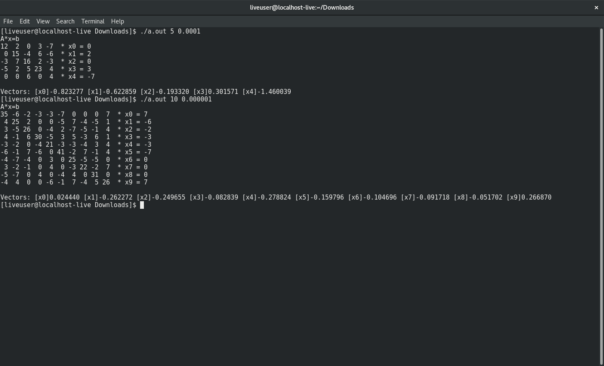

Uses the Jacobi method (A*x = b) with a randomized array of numbers to locate the vector x.

Definition:
Jacobi Method - An iterative algorithm for determining the solutions of a diagonally dominant
system of linear equations.

Run by passing in 2 command line arguments: the number of iterations and the margin of error.
Ex:
* 5 0.0001
* 10 0.000001

